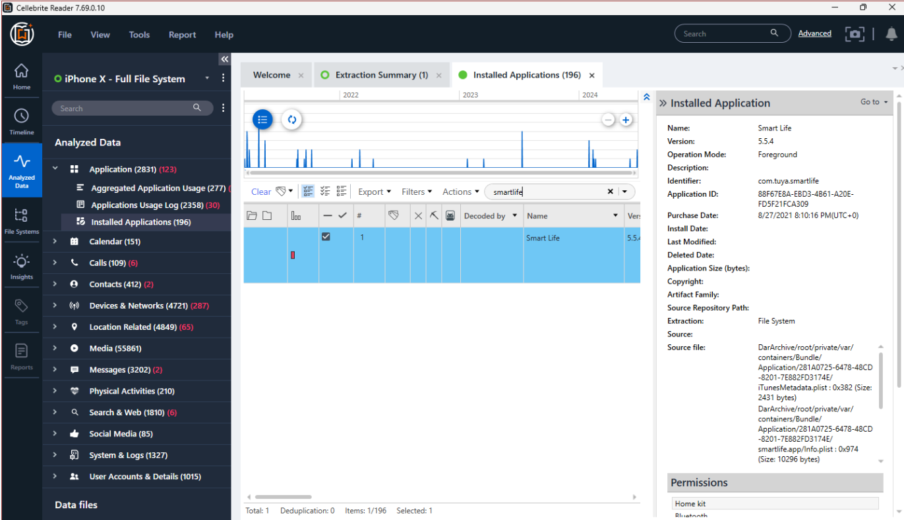
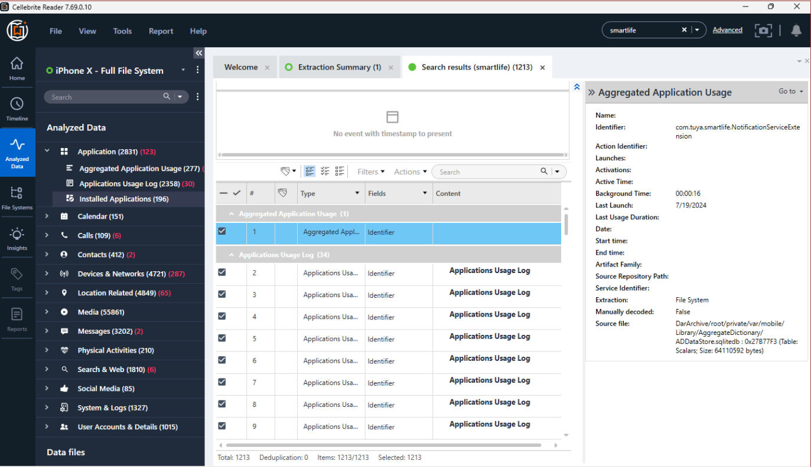
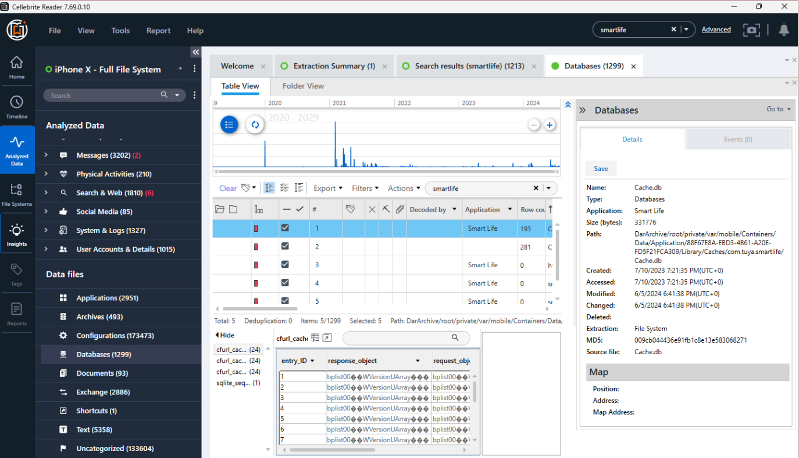
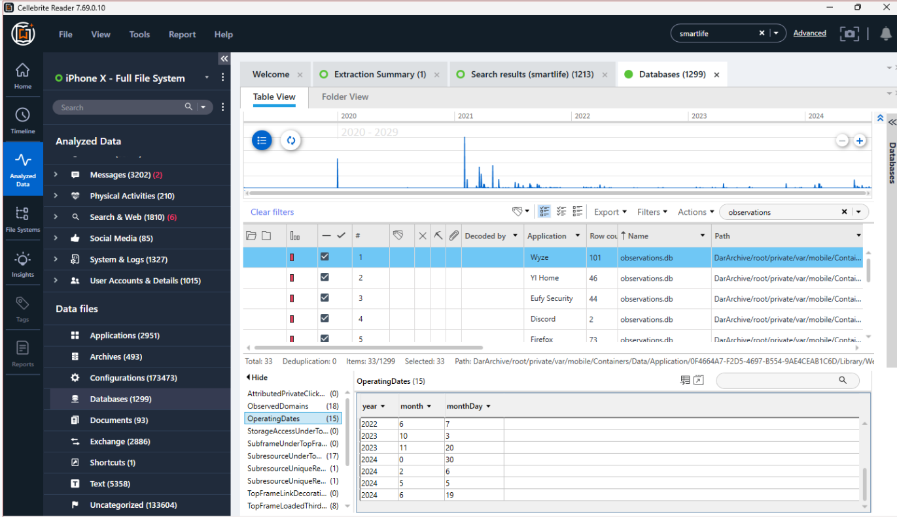

# iOS Forensic Investigation: Artifact Findings

## Investigation Overview

This case study documents artifacts identified in an iPhone X full file system report using Cellebrite Reader. The examination focused on the SmartLife application and associated application, email, network, and database records.

The findings below are based on the completed Lab 8.1 iOS IoT Evidence examination.

## 1. Installed Application Artifacts

Cellebrite Reader identified the following SmartLife application information:

| Artifact | Finding |
|---|---|
| Application | SmartLife |
| Version | 5.5.4 |
| Application identifier | `com.tuya.smartlife` |
| Recorded purchase date | August 27, 2021, 8:10:16 PM UTC |
| Listed permissions | HomeKit, Bluetooth, and Camera |

## Supporting Forensic Screenshots

The following screenshots document the iPhone X portion of the completed iOS and Android IoT evidence lab, using Cellebrite Reader to examine SmartLife application artifacts.
### Figure 1: SmartLife Installed Application

**Figure 1.** Cellebrite Reader examination of the SmartLife application installed on the iPhone X evidence dataset.

### Figure 2: SmartLife Case-Wide Search

**Figure 2.** Case-wide search identifying 1,213 results associated with SmartLife, providing leads for further examination of application and device activity.

### Figure 3: SmartLife Database Identification

**Figure 3.** Cellebrite Reader examination of the Smart Life application's `Cache.db` database within the iPhone X file-system extraction, showing database metadata and accessible tables for further artifact analysis.

### Figure 4: Observations Database Examination

**Figure 4.** Cellebrite Reader examination of the Wyze application's `observations.db` database, showing the `OperatingDates` table and associated date records recovered from the iPhone X evidence dataset.

**Forensic significance:** The `observations.db` artifact demonstrates that the iPhone X evidence contains database records associated with another smart-home application, Wyze. The visible `OperatingDates` table provides potential leads for further examination and cross-application correlation. The presence of these records alone does not establish that a particular smart-home device was operated on the listed dates.

## 2. Case-Wide Artifact Search

A case-wide search for `smartlife` returned **1,213 results**.

The worksheet identified these result categories:

- Aggregated Application Usage
- Application Usage Log
- Emails
- Installed Applications
- Log Entries
- Wireless Networks

**Forensic significance:** The 1,213 results represent case-wide search matches for `smartlife`, not 1,213 confirmed application launches or smart-home device interactions. Searching across artifact categories provides investigative leads that may be correlated with application records, communications, usage data, and network information.

## 3. Email Artifacts

The search identified **five emails** containing `smartlife`.

The completed worksheet describes these as registration-verification emails associated with different applications.

| Email | Recorded timestamp (UTC) |
|---|---|
| 1 | May 25, 2021, 3:08:13 AM |
| 2 | April 3, 2022, 7:33:19 PM |
| 3 | August 27, 2021, 8:11:29 PM |
| 4 | February 1, 2024, 10:07:27 PM |
| 5 | February 1, 2024, 10:29:46 PM |

**Forensic significance:** Verification emails may help establish an application-registration timeline. Their presence alone does not establish that a particular individual completed each registration.

## 4. Application and Network Log Artifacts

The worksheet records the following information from the first numerically listed log entry:

| Field | Finding |
|---|---|
| Timestamp | July 9, 2024, 6:30:01 PM UTC |
| Source | `iphoneNetworkDataUsage` |
| WAN In | 8,218 |
| WAN Out | 3,514 |

**Forensic significance:** Network-usage records can provide additional context about application-related activity. These values should not be interpreted as the contents of transmitted communications.

## 5. Wireless Network Artifacts

The examination identified wireless-network records containing SmartLife-related network names, including:

- `SmartLife-0D13`
- `SmartLife-1D90`
- `SmartLife-061D`

The worksheet also records associated BSSID and timestamp information.

**Forensic significance:** Wireless-network artifacts may support investigation of device connectivity and relationships with nearby IoT equipment. A saved or recorded network entry does not, by itself, prove that a particular person operated an IoT device.

## 6. SQLite Database Examination

Searching the database artifacts for `smartlife` returned **five databases**.

The examination included `observations.db` and its:

- `Operating Dates` table
- `Observed Domains` table

The `Observed Domains` examination included a `lastSeen` value for `amazonaws.com`. Using DCode with the **Unix: Millisecond Value** format, the worksheet records the decoded timestamp as:

**January 30, 2024, 20:50:05 UTC**

A separate search for `feit` returned **two databases**.

**Forensic significance:** Database records can provide application-specific context that may not be visible in Cellebrite Reader’s higher-level artifact categories. Decoding stored timestamps helps place records into a consistent investigative timeline.

## 7. Findings and Limitations

The iPhone X report contained SmartLife application metadata, verification emails, network-related records, and database artifacts. Together, these provide multiple sources for examining SmartLife-related activity.

This case study documents findings from an existing Cellebrite Reader report. It does not claim that the examiner personally performed the original device acquisition.

The recorded timestamps should be interpreted with attention to their displayed time zone. The lab instructions specifically caution that some timestamps may not convert automatically.

No raw mobile extraction, private communications, account credentials, or unredacted personal information are included in this public portfolio.
