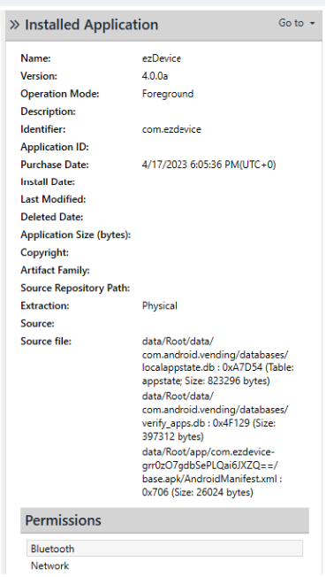
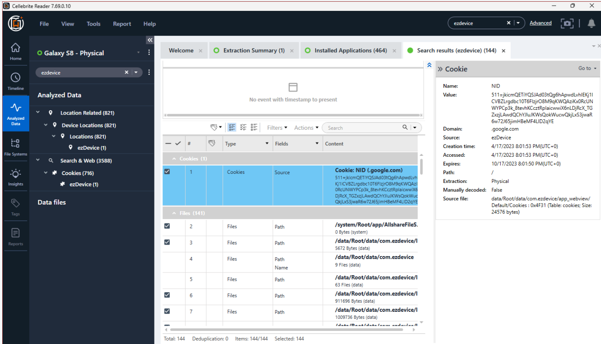
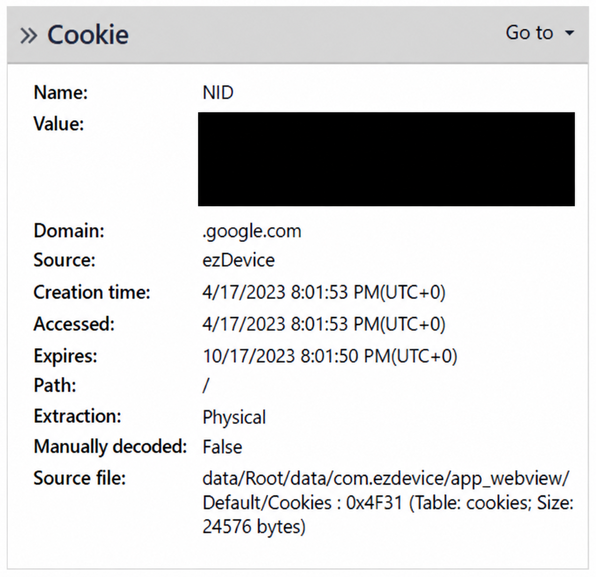
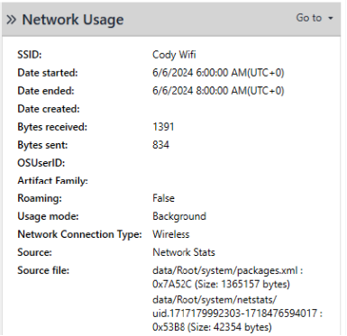
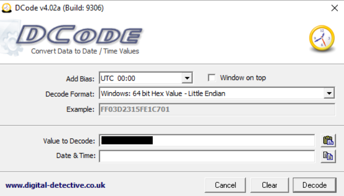
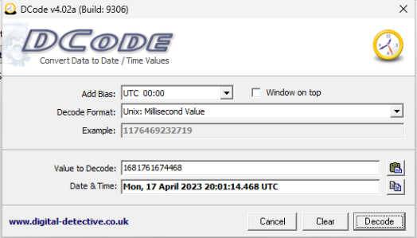

# Android IoT Artifact Findings

## 1. Evidence Source

This case study documents findings recorded during examination of the **Galaxy S8 Physical** dataset using Cellebrite Reader. The investigation focused on Android application artifacts and records associated with the `ezDevice` application and an IoT device.

The findings below are drawn from the completed Lab 8 examination worksheet. They describe artifacts present in the supplied forensic dataset, not a live examination of an independently acquired device.

## 2. Installed Application: ezDevice

The installed-application examination recorded the following information:

| Field                  | Recorded finding               |
| ---------------------- | ------------------------------ |
| Application            | ezDevice                       |
| Version                | 4.0.0a                         |
| Recorded purchase date | April 17, 2023, 6:05:36 PM UTC |
| Application identifier | `com.ezdevice`                 |
| Listed permissions     | Bluetooth / Network            |

**Forensic significance:** The application metadata establishes that the examined dataset contains an installation record for `ezDevice`. The listed permissions provide context for examining Bluetooth and network-related artifacts, but do not independently establish how the application was used.

## Supporting Forensic Screenshots

### Figure 1: ezDevice Installed Application

**Figure 1.** Cellebrite Reader examination of the ezDevice application identified in the Galaxy S8 Physical evidence dataset.

### Figure 2: ezDevice Case-Wide Search

**Figure 2.** Case-wide search results associated with ezDevice, providing leads for further examination across available artifact categories.

### Figure 3: ezDevice Cookie Artifact

**Figure 3.** Cellebrite Reader examination of an NID cookie associated with ezDevice in the Galaxy S8 Physical evidence dataset. The cookie value has been redacted.

**Forensic significance:** The cookie record identifies a source, domain, and timestamps that may support correlation of application and web artifacts. Its presence alone does not establish user attribution or prove a specific browsing action.

### Figure 4: Android Wireless Network Usage

**Figure 4.** Cellebrite Reader network-usage artifact from the Galaxy S8 Physical evidence dataset. The record identifies the wireless network as `Cody Wifi` and shows a usage window from June 6, 2024, 6:00 AM to 8:00 AM UTC. It records 1,391 bytes received and 834 bytes sent, with background usage indicated.

**Forensic significance:** This artifact provides a timestamped record of wireless network activity that may support timeline reconstruction. The recorded byte counts do not reveal communication contents, identify the device operator, or independently establish that the ezDevice application generated the traffic.

### Figure 5: DCode Timestamp Conversion

**Figure 5.** DCode timestamp-conversion workflow used during the Galaxy S8 forensic examination. This screenshot documents the timestamp input and conversion settings used for the analysis.

### Figure 6: DCode Decoded Timestamp Result

**Figure 6.** DCode output showing the decoded timestamp associated with the examined artifact.

**Forensic significance:** Timestamp decoding helps place artifacts into a consistent investigative timeline. The examiner must verify the source timestamp format, conversion settings, and time zone before correlating the result with other device records.

## 3. Case-Wide Artifact Search

A case-wide search for `ezdevice` returned **144 results**.

The completed worksheet identified results under these categories:

* Location Related
* Device Locations
* Locations
* Search and Web
* Cookies

**Forensic significance:** These search results provide investigative leads across multiple artifact categories. A search hit alone does not establish that every returned record was generated directly by the `ezDevice` application.

## 4. Cookie Artifact

The worksheet recorded a cookie with the following details:

| Field           | Recorded finding                 |
| --------------- | -------------------------------- |
| Domain          | `google.com`                     |
| Creation time   | April 17, 2023, 8:01:53 PM UTC   |
| Expiration time | October 17, 2023, 8:01:50 PM UTC |

**Forensic significance:** The cookie provides a timestamped web artifact that may be compared with other application and device events. Its presence alone does not establish the purpose of the associated browsing activity.

## 5. Network-Usage Artifact

The examination recorded the following details for network-usage result **#606**:

| Field          | Recorded finding        |
| -------------- | ----------------------- |
| SSID           | `Cody WIFI`             |
| Bytes received | 1,391                   |
| Bytes sent     | 834                     |
| Application ID | `com.google.android.gm` |

**Important distinction:** The application ID in this network-usage record does **not** match the `ezDevice` identifier, `com.ezdevice`. The record should therefore not be presented as proof that `ezDevice` transferred those bytes.

The start and end dates in the worksheet contain an apparent year-formatting error (`6//6/204`). Those dates should be verified against the original Cellebrite display before inclusion in a public timeline.

## 6. Application Database: Data Transport Events

The examination identified the database:

`/data/Root/data/com.ezdevice/databases/com.google.android.datatransport.events`

Within `global_log_event_state`, the worksheet recorded:

| Field                 | Recorded finding                        |
| --------------------- | --------------------------------------- |
| Field name            | `last_metrics_upload_ms`                |
| Stored value          | `1681761674468`                         |
| Recorded decoded date | April 17, 2023, approximately 20:01 UTC |

**Forensic significance:** The database contains a stored metrics-upload timestamp that may assist with timeline reconstruction. The timestamp should not be treated as proof that an IoT command was issued or that a particular person operated the device.

## 7. Application Database: RKStorage

The examination identified:

`/data/Root/data/com.ezdevice/databases/RKStorage`

The `catalystLocalStorage` records included keys named `property`, `user`, and `devices`.

The `user` object contained account-related configuration information, including a username, password field, login setting, and application version information. **Account credentials and other sensitive values are intentionally omitted from this public case study.**

The `devices` object contained an `info` record with the following selected findings:

| Field                | Recorded finding               |
| -------------------- | ------------------------------ |
| Online status        | `True`                         |
| Device type          | `ezOutlet2`                    |
| Hostname             | `EZT-033010`                   |
| Recorded system time | April 17, 2023, 8:07:24 PM UTC |

The worksheet also recorded device identifiers and WAN/LAN network configuration values. Those details can support correlation between application records and the associated IoT device; unnecessary identifiers are omitted here.

The `settings → network` object recorded a device IP address that matched the `lanIP` value in the `info` object.

**Forensic significance:** `RKStorage` provides application-level evidence of a configured `ezOutlet2` device and related account and network settings. The recorded online status describes a value stored in the dataset, not the device’s current availability.

## 8. Findings and Limitations

The Galaxy S8 dataset contains multiple artifact types relevant to the `ezDevice` application, including installation metadata, search results, cookie records, database entries, and IoT device configuration information.

The `RKStorage` records provide a particularly useful basis for correlating the application with an `ezOutlet2` device. However, the available findings do not independently establish who operated that device or what physical actions it performed.

This public report omits passwords, account identifiers, and unnecessary device-specific identifiers. The original assignment and forensic evidence should be retained separately from the public GitHub portfolio.
